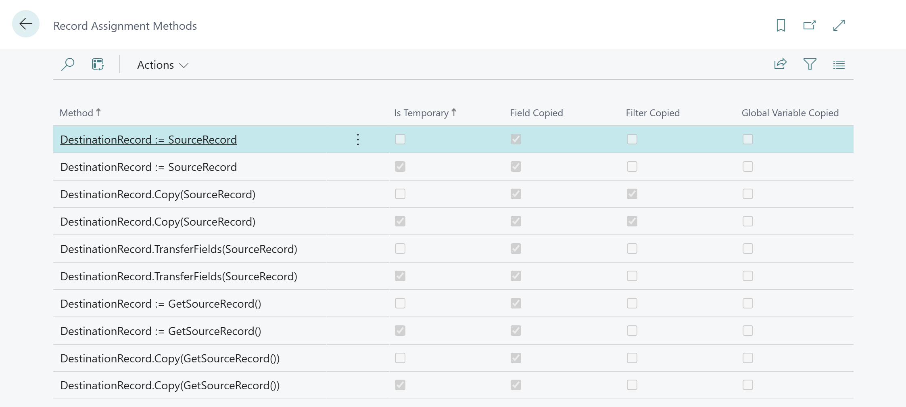

# Record Assignment Methods

## Overview

This repository tries to answer a common question in AL: what is the behavior of different record assignment methods?
In AL we have the following methods to assign records:
- `Record.Copy` : https://learn.microsoft.com/en-us/dynamics365/business-central/dev-itpro/developer/methods-auto/record/record-copy-method
- `Record.TransferFields` : https://learn.microsoft.com/en-us/dynamics365/business-central/dev-itpro/developer/methods-auto/record/record-transferfields-table-boolean-method
- Direct record assignments using the `:=` operator
- Assignments using the `:=` with a record as the result of a function call 
- Copy of a record from the result of a function call

## Tests

The app in this repository contains a test page that allows you to test the behavior of these methods.

Please note these tests suppose that the source and destination records are of the same type, it does not discuss the behavior of TransferFields when the source and destination records are of different types.
It tests the different methods described above for regular records and temporary records.
The following things are tested:
- Does the assignment copies record fields?
- Does the assignment copies filters set on the source record?
- Does the assignment copies the global variables set in the source table object instance?

## Results

The results of the tests are available below and have been done on Business Central 2025 wave 1 (aka. BC 26)... just in case the behavior changes in the future 😆.

## Conclusion

Whatever method you use:

- Fields are **always** copied
- Global variables are **never** copied

The filters are only copied when using `Record.Copy` directly from a record variable, and not from a function result.